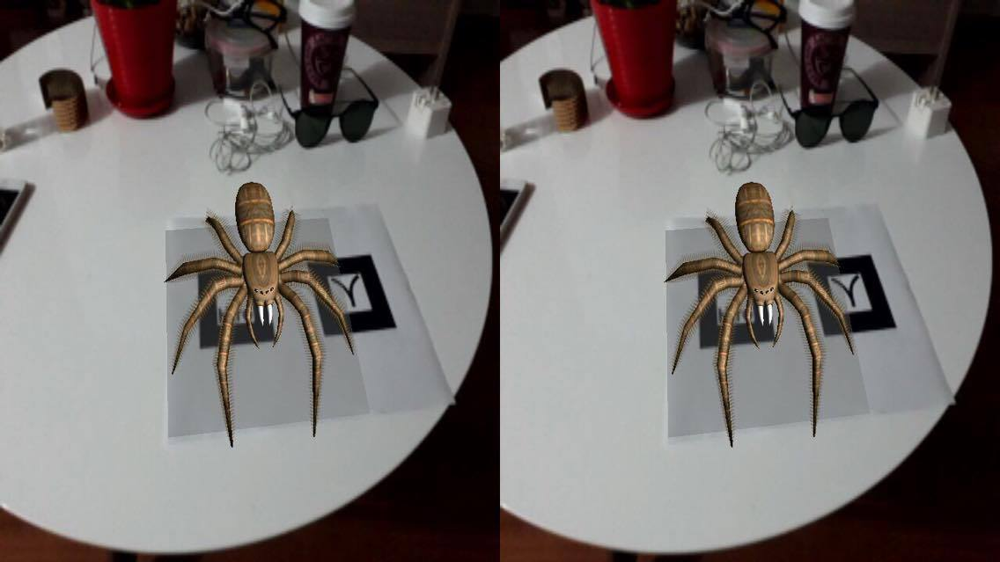
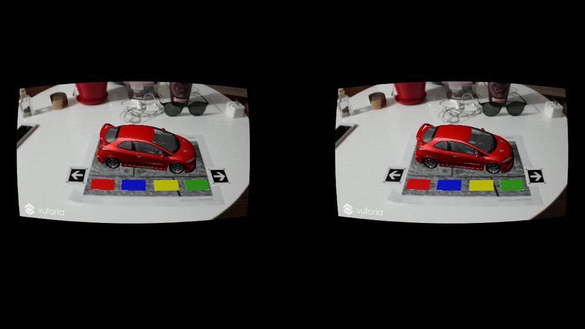

# cardboAR
This is *Mixed Reality for poor people*, the idea is use the phone's camera  to emulate the "optical see through" effect, also to test how the "mono to stereo" affect the experience.

### Experiment 1

ARtoolkit + unity

apk:https://developer.cloud.unity3d.com/share/WyIIv6TiHz/

target: https://github.com/artoolkit/artoolkit5/blob/master/doc/patterns/Hiro%20pattern.pdf

### Experiment 2

vuforia + unity

target: https://github.com/calderonsteven/cardboAR/blob/master/vuforiAR/Assets/Editor/Vuforia/ForPrint/target_wood_A4.pdf

